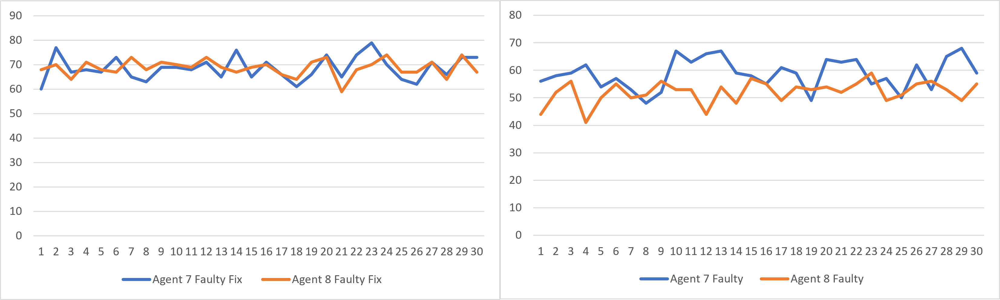

# Circle of Life
> CS-520 (Introduction to Artificial Intelligence) Project 2  
> > By: Keshav S. (ks1830), Shashwath S. (sks272)

[Github](https://github.com/keshavshivkumar/CircleofLife)

## Overview

- Circle of Life is the second project under the Rutgers' CS-520 class taught by Dr. Charles Cowan.
- The project aims to understand how to build a probabalistic model of decision making for an agent in an environment to catch a prey while also avoiding a predator.
- The agent is provided different levels of information of the prey and predator, and must use the information to make decisions.

# Environment

## Design

- The environment of this project revolves around a `Graph` of 50 nodes. The graph is circular, and the max degree of each node does not exceed 3.
- Edges are randomly generated between nodes besides the adjacent node edges.
- The nodes of the graph are of the `Node` class. Each node has a:
    - position attribute (a number to describe the node number in the graph)
    - agent attribute (if the agent is in that node)
    - prey attribute (if the prey is in that node)
    - predator attribute (if the predator is in that node)
    - neighbor attribute (a set of the node's neighbor)
- The agent is from the `Agent` class. Depending on the environment, there are different implementations of the agent, but all agents have the following attributes in common:
    - node attribute (current position of the agent in the graph)
    - a list of nodes (to keep track of the node positions to maintain probabilities for)
    - ints for storing the correct prey/predator belief, for analysis

- The prey is built from the `Prey` class.
- The prey simply chooses an adjacent neighbor to move to at each timestep or chooses not to move. The choice is arbitrary.
- There are 2 types of predators: `Predator` and `DistractedPredator`.
    - The default predator is used against Agents 1-4.
    - The distracted predator is used against Agents 5-8.
- The agent node is a heat-seeking node for the predator; every timestep, the predator attempts to move towards the agent.
- The distracted predator has a chance of fumbling and getting distracted 40% of the time, moving to one of its neighbors instead of towards the agent.

## Implementation

- Graph traversal was done using BFS. Using BFS gives the shortest path between 2 nodes.
- The bfs algorithm is the backbone of the agent's and predator's movement. On the other hand, the prey chooses a random position among its neighbor nodes (including its current position) and moves there.
- There are 2 variants of bfs: `bfs()` and `agent_bfs()`. `bfs()` provides the shortest path between 2 nodes, while the latter returns the paths between the agent and the prey & predator.
- Using these paths, the prey and predator nodes are known, and the bfs paths for each of the agent's neighbors to the prey and predator can be found as well.
- With these 4 bfs paths, the agent chooses the optimal neighbor based on the project specifications to move to.

## Analysis

- Only a maximum number of 25 additional edges can be added to the graph as each node can have a max degree of 3. So 1 extra edge between every 2 nodes. 50/2 = 25.
  
- The smallest number of edges you can add in the graph is 20, because at max only 10 nodes can have degree < 2 with a graph of 50 nodes.

## Workload Split-up

> Design and Implementing:
> > Shashwath, Keshav

> Debugging and code correctness:
> > Shashwath

> Data Collection:
> > Keshav

## Agent 1

## Design

- `Agent1` knows the locations of the prey and predator in the graph. Using the locations of both, the agent makes its move towards the optimal neighbor.
- The optimal neighbor is based on the following order of preference:
    1. Closer to the Prey, farther from the Predator
    2. Closer to the prey, not closer to the Predator
    3. Not farther from the Prey, farther from the Predator
    4. Not farther from the Prey, not closer to the Predator
    5. Farther from the predator
    6. Not closer to the predator
- If the above are not satisfied, the agent does not move and hopefully survives.

## Implementation

- A priority variable is set to infinity. This priority variable chooses the best agent neighbor based on how low it becomes.
- The priority value is set based on the above conditions, implying the lower the priority, the better the choice of neighbor is (lowest priority is 1).
- If there is a tie of priority, the ties are broken at random.

## Observations

- The conditions enable the agent to frequently catch the prey and not die.
- The win rate for 150 timesteps is on average 87.03333333%.
- The loss rates are:
    - 0% due to timeout.
    - 12.96666667% due to death from predator.

## Inference

- In an ideal environment, where the agent has knowledge of where the prey and predator are, it is easy for it to target the prey while also avoiding the predator.
- Another condition could be added to run away from the predator, and the agent will eventually catch the prey. But this will be costly in terms of timesteps.

# Agent 2

## Design

- `Agent2` is provided the same conditions as `Agent1`. How do we make Agent 2 perform better?
- Rather than considering the current positions of the prey and predator, the agent can anticipate where the prey and predator will move in advance.

## Implementation

- The farthest neighbor of the prey is selected as its anticipated move. The path from the agent to that neighbor will cover the other neighbors of the prey as well.
- This is implemented using the `predicted_prey_move` function, and it returns the farthest path of the prey to the agent.
- The anticipated position of the predator will simply be the next node in the bfs path of the predator to the agent's neighbor.

## Observations

- Agent 2 catches the prey more frequently than Agent 1.
- The win rate for 150 timesteps is on average 96.36666667%.
- The loss rates are:
    - 0.1% due to timeout.
    - 3.533333333% due to death from predator.

## Inference

- In an environment with the necessary information, Agent 2 performs exceptionally well compared to Agent 1.

## Agent 3

## Design

- `Agent3` is expected to catch the prey, not knowing where the prey is in the environment, but knowing where the predator is.
  
- The agent does have the luxury of surveying a node to check if the prey is there.

  
- Before a node is picked to survey, the probability of the agent node is distributed to the rest of the nodes (since the prey is not present in that node). 
  
- Let ${prey_i} =$ Prey present in Node $i$ according to survey
  
- The node with the highest probability $P(Prey_i)$ is picked and is surveyed.
    - If the prey is not found, then the belief of that node is distributed.
    - If the prey is found, the belief of that node becomes 1 and the rest of the beliefs become 0.

- The node with highest $P(Prey_i)$ is assumed to be the prey, and the agent moves accordingly.
- After the agent makes its move, the beliefs are propagated to the non-zero beliefs in the dictionary.

### Belief Distribution
$$P(prey_i| \neg{prey_j}) = {P(prey_i, prey_j) \over{P(\neg{prey_j}) }}; i \neq j$$
 
$$= {P(prey_i)\times P(\neg{prey_j}| prey_i) \over P(\neg{prey_j})}$$

$$= {P(prey_i)\times 1 \over \sum P(prey_i)*p(\neg{prey_j}|prey_i)}$$

$$= { P(prey_i) \over 1 - P(prey_j)}$$

- If $P(prey_i) = 1$, then $P(prey_j) = 0$, $\forall j$, ${j \neq i }$

### Transition Update

$$P(prey_{i}) = {       \sum_{k=1}^{n} P(prey_k) \times P(prey_{i}|prey_k)    }$$
where $P(prey_i|prey_k) =$ Probability of moving to Node $i$ from Node $k$

## Implementation

- In the beginning, all the nodes are provided a probability of 1/49; considering the number of nodes in the graph to be 50, and the number of nodes the prey can be in is 49 (the agent is already in a node, so the prey can't be there). This is carried out by the `initialize_belief` function.
- The beliefs are stored in a dictionary of the `Agent3` class. Only the nodes with non-zero belief are stored in the dictionary.
- The agent surveys a node using `survey_node()`.
- If the prey is present in that node, then the dictionary is reset and only that node is added to the dictionary with a probability of 1.
- Otherwise, the node picked gets removed from the belief dictionary, and its probability is distributed to the rest of the nodes.
- The agent moves assuming the node with the highest $P(prey_i)$ to have the prey, and follows the set of rules defined in `Agent1` (the location of the predator is known).
- The belief of the prey to is propogated to the rest of the nodes in the belief dictionary.

## Observations

- The agent performs very well, considering the environment provides only partial information.
- The win rate for 150 timesteps is on average 83.5%.
- The loss rates are:
    - 0% due to timeout.
    - 16.5% due to death from predator.
- The agent was able to identify the prey node correctly about 3.9295887% of the timesteps.

## Inference

- Not knowing where the prey is barely affects the success of the agent, since knowing where the predator is means that the agent moves precisely away from the predator as much as possible.
- It is difficult to keep track of the prey once discovered, since its movement is random.

# Agent 4

## Design

- `Agent4` is provided with the same conditions as `Agent3`.
- Similar to `Agent2`, Agent 4 uses the anticipated positions of the prey and predator.

## Implementation

- Agent 4 bootstraps off `Agent3` since the probability distribution remains the same.
- The only part that changes is the nodes considered to be where the prey and predator will be after the agent moves.
- The anticipated prey position is returned using `predicted_prey_move` on the node that the prey is believed to be in.
- The anticipated predator position is returned similar to Agent 2: the next node in the bfs path of the predator to the agent's neighbor.

## Observations

- Agent 4 performs really good, and better than Agent3 on average.
- The win rate for 150 timesteps is on average 95.3%.
- The loss rates are:
    - 0.2% due to timeout.
    - 4.5% due to death from predator.
- The agent was able to identify the prey node correctly about 4.7386829% of the timesteps.

## Inference

- In a partial information environment, Agent 4 fares well.
- Both Agent 3 and Agent 4 have reasonably good success rates; knowing where the predator is ensures that the agent will not die that easily.

## Agent 5

## Design

- `Agent5` is expected to catch the prey, not knowing where the predator is exactly in the environment (the agent only knows in the first timestep where the predator is).
    
- Before a node is picked to survey, the probability of the agent node is distributed to the rest of the nodes (since the predator is not present in that node). 
  
- Let ${predator_i} =$ predator present in Node $i$ according to survey
  
- The node with the highest probability $P(predator_i)$ is picked and is surveyed.
    - If the predator is not found, then the belief of that node is distributed.
    - If the predator is found, the belief of that node becomes 1 and the rest of the beliefs become 0.

- The node with highest $P(predator_i)$ is assumed to be the predator, and the agent moves accordingly.
- After the agent makes its move, the beliefs are propogated to the non-zero beliefs in the dictionary.

### Belief Distribution

- Belief update remains the same between `Agent 3` and `Agent 5`
$$ 
    P(predator_i| \neg{predator_j}) = {P(predator_i, predator_j)\over P(\neg{predator_j}) }
    ; i \neq j
$$
 
$$ 
    = {P(predator_i)\times P(\neg{predator_j}| predator_i) \over P(\neg{predator_j})}
$$

$$
    = {
        P(predator_i)\times 1 \over 
        \sum P(predator_i)*p(\neg{predator_j}|predator_i)
    }
$$

$$
    = { P(predator_i) \over 1 - P(predator_j)}
$$

- If $P(predator_i) = 1$, then $P(predator_j) = 0$, $\forall j$, ${j \neq i }$

### Transition Update
- Distracted Predator moves to close in distance to agent at Prob = 0.6, $P(optimal) = 0.6$. It moves randomly to any of its neighbors at Prob = 0.4, $P(distracted) = 0.4$
$$
    P(predator_{i}) = 
        \sum_{k=1}^{n} P(Predator_{k}) \times P(predator_{i}|predator_k)
    
$$

$$
    = 0.6 \sum_{k=1}^{n} optimal(P(predator_i|predator_j))
$$
$$
    +
    0.4\sum_{k=1}^{n} distracted(P(predator_i|predator_j))
$$
where $P(predator_i|predator_k) =$ Probability of moving to Node $i$ from Node $k$.

## Implementation

- In the beginning, the agent knows where the predator is and prob of that node is initialized to 1. This is carried out by the `initialize_belief_with_position` function.

- The beliefs are stored in a dictionary of the `Agent5` class. Only the nodes with non-zero belief are stored in the dictionary.
  
- The agent surveys a node using `survey_node()`.
- If the predator is present in that node, then the dictionary is reset and only that node is added to the dictionary with a probability of 1.
- Otherwise, the node picked gets removed from the belief dictionary, and its probability is distributed to the rest of the nodes.
- The agent moves assuming the node with highest $P(predator_i)$ to have the predator, and follows the set of rules defined in `Agent1` (the location of the prey is known).
- The belief of the predator is propogated to the rest of the nodes in the belief dictionary.

## Observations

- The agent performs decently well, considering the environment provides only partial information.
- The win rate for 150 timesteps is on average 80.63333333%.
- The loss rates are:
    - 0% due to timeout.
    - 19.36666667% due to death from predator.
- The agent was able to identify the predator node correctly about 58.0649433% of the timesteps.

## Inference

- Not knowing where the predator significantly affects the success of the agent, since knowing where the predator means that the agent moves precisely away from the predator.
- Figuring out the position of the predator is easier than the prey, since its choice of movement is not completely random.

## Agent 6

## Design

- `Agent6` is provided with the same conditions as `Agent5`.
- Similar to `Agent2` and `Agent4`, Agent 6 uses the anticipated positions of the prey and predator.

## Implementation

- Agent 6 bootstraps Agent 5. The only change is which nodes are considered as prey and predator when the agent is making a move.
- Agent 6 considers the (immediate) future positions of the prey and predator and chooses the best move based on the rules defined in `Agent1`.
- The anticipated prey position is returned similar to Agent 2: using `predicted_prey_move`, the farthest prey position is considered as the position the prey will move to.
- The anticipated predator move is the next node in the bfs path of the node the predator is believed to be in.

## Observations

- `Agent6` and `Agent5` perform well despite not knowing the position of the predator.
- Agent 6 performs relatively better than Agent 5.
- However they are relatively worse than `Agent3` and `Agent4`.
- The win rate for 150 timesteps is on average 85.8%.
- The loss rates are:
    - 0.066666667% due to timeout.
    - 14.13333333% due to death from predator.
- The agent was able to identify the predator node correctly about 65.3833067% of the timesteps.

## Inference

- The success rates Agent 5 and 6 suffer due to the lack of knowledge of the predator.
- Figuring out the position of the predator is easier than the prey, since its choice of movement is not completely random.

## Agent 7

## Design

- `Agent7` is expected to catch the prey, not knowing where the prey and predator are exactly in the environment (the agent knows where the predator is in the first timestep only).
    
- Before a node is picked to survey, the probability of the agent node is distributed to the rest of the nodes (since the predator is not present in that node). 
  
- If there exists an $i$ such that $P(predator_i) = 1$, the highest probablity of $P(prey_i)$ is surveyed, else the node with highest $P(predator_i)$ is surveyed.

- Probability is distributed the same way as it was done in `Agent 5` and `Agent 3`

- The node with highest $P(predator_i)$ is assumed to be the predator, and the node with the highest $P(prey_i)$ is assumed to be the prey, and the agent moves accordingly.
- After the agent makes its move, the beliefs are propogated to the non-zero beliefs in the dictionary.

- Belief distribution and Transition probabilities remain unchanged from `Agent 3` and `Agent 5`

## Observations

- The agent performs decently well, considering the environment provides only partial information.
- The win rate of the agent is on average 78.43333333%.
- The loss rates are:
    - 0.233333333% due to timeout.
    - 21.33333333% due to death from predator.
- The agent was able to identify the prey node correctly about 0.9898483% of the timesteps.
- The agent was able to identify the predator node correctly about 45.1441661% of the timesteps.

## Inference

- Not knowing where the predator significantly affects the success of the agent, since knowing where the predator means that the agent moves precisely away from the predator.

## Agent 8

## Design

- `Agent8` is put in the same environment as `Agent7`, with minimal knowledge of the prey and the predator.
- The agent only knows where the predator is in the first timestep, and has no knowledge of the prey.
- Similar to `Agent2`, `Agent4` and `Agent6`, Agent 8 uses the anticipated positions of the prey and predator.

## Implementation

- Agent 8 boostraps Agent 7, like the other even-numbered agents.
- The anticipated positions of the believed prey and predator are considered for the agent to move.

## Observations

- Agent 8 performs neck-to-neck with Agent 7. Both perform considerably well.
- When the timesteps are more, Agent 8 performs relatively better than Agent7.
- The win rate for 150 timesteps is on average 79.53333333%.
- The loss rates are:
    - 0.466666667% due to timeout.
    - 20% due to death from predator.
- The agent was able to identify the prey node correctly about 1.7391908% of the timesteps.
- The agent was able to identify the predator node correctly about 47.824446% of the timesteps.

## Inference

- Not knowing where the predator significantly affects the success of the agent, since knowing where the predator means that the agent moves precisely away from the predator.
- Not knowing where both the prey and predator are minimizes the gap of success between Agent 7 and Agent 8.

# Agent 7 (with faulty survey and fix)

## Design

- The same design as `Agent 7` but with faulty survey
  
- Let $P(survey_i)$ = $P(prey_i)$ or $P(predator_i)$ depending on what we are surveying for.

- Given that $P(\neg{survey_i}) =0.1$ , $P(survey_i) =0.9$. 

### Belief update to account for faulty survey

$$P(prey_i| \neg{survey_j}) = {P(prey_i, survey_j) \over{P(\neg{survey_j}) }}$$

$$= {P(prey_i)\times P(\neg{survey_j}| prey_i) \over P(\neg{survey_j})}$$

$$= {P(prey_i)\times P(\neg{survey_j}| prey_i) \over \sum P(prey_i)*p(\neg{survey_j}|prey_i)}$$

$$= { P(prey_i) \times P(\neg{survey_j}| prey_i) \over 1 - P(survey_i) \times P(survey_j)}$$

so we get,
$$P(prey_i| \neg{survey_j}) = { P(prey_i) \times 1 \over 1 - 0.9 \times P(survey_j)}; i \neq j$$

$$P(prey_i| \neg{survey_j}) = { P(prey_i) \times 0.1 \over 1 - 0.9 \times P(survey_j)}; i = j$$

- Transition probabilities remain unchanged from `Agent 7`

## Observations (Faulty survey)

- The win rate of the agent is on average 58.76666667%.
- The loss rates are:
    - 0% due to timeout.
    - 41.83333333% due to death from predator.
- The agent was able to identify the prey node correctly about 3.298517493% of the timesteps.
- The agent was able to identify the predator node correctly about 37.14797583% of the timesteps.
- 
## Observations (Faulty survey fix)

- The win rate of the agent is on average %.
- The loss rates are:
    - % due to timeout.
    - % due to death from predator.
- The agent was able to identify the prey node correctly about % of the timesteps.
- The agent was able to identify the predator node correctly about % of the timesteps.
## Agent 8 (with faulty survey and its fix)

## Design

- The same design as `Agent7Faulty` with the node picking the same as the even agents.

### Observations (Faulty survey)

- The win rate of the agent is on average 52.1%.
- The loss rates are:
    - 0.066666667% due to timeout.
    - 47.83333333% due to death from predator.
- The agent was able to identify the prey node correctly about 2.434142243% of the timesteps.
- The agent was able to identify the predator node correctly about 30.30457358% of the timesteps.

### Observations (Faulty survey fix)

- The win rate of the agent is on average %.
- The loss rates are:
    - % due to timeout.
    - % due to death from predator.
- The agent was able to identify the prey node correctly about % of the timesteps.
- The agent was able to identify the predator node correctly about % of the timesteps.

## Details

- All agents were run 100 iterations per run.
- Each Iteration was run on a different graph
- 30 total runs.

## Results

- Comparison of Win-rates/Success between all agents:

- we can see that with the strategy of even agents, they consistently outperform odd agents.

`Agent 7` performs much better than `Agent 8` with faulty survey, 
Average Win-rate in each run:
| Timesteps 	|  Agent 1 	|  Agent 2 	|  Agent 3 	|  Agent 4 	|  Agent 5 	|  Agent 6 	|  Agent 7 	| Agent 7 Faulty 	| Agent 7 Faulty Fix 	|  Agent 8 	| Agent 8 Faulty 	| Agent 8 Faulty Fix 	|
|:---------:	|:--------:	|:--------:	|:--------:	|:--------:	|:--------:	|:--------:	|:--------:	|----------------	|:------------------:	|:--------:	|----------------	|:------------------:	|
|     50    	| 87.63333 	|   95.4   	| 77.43333 	| 83.63333 	| 79.53333 	|   78.7   	| 66.33333 	| 55.2           	|        61.3        	| 63.63333 	| 47             	|      55.66667      	|
|    100    	| 89.86667 	| 96.63333 	| 82.93333 	| 95.53333 	|   82.4   	| 85.63333 	| 78.03333 	| 56.83333       	|        69.3        	|   76.9   	| 51.66667       	|      67.33333      	|
|    150    	| 87.03333 	| 96.36667 	|   83.5   	|   95.3   	| 80.63333 	|   85.8   	| 78.43333 	| 58.76666667    	|        68.6        	| 79.53333 	| 52.1           	|     68.73333333    	|
|    200    	| 87.93333 	|   97.2   	| 84.06667 	|   95.9   	|   81.9   	| 86.23333 	| 78.03333 	| 59.1           	|        68.3        	| 79.86667 	| 52.1           	|      66.93333      	|

Average number of times Agent dies to Predator:
| Timesteps 	|  Agent 1 	|  Agent 2 	|  Agent 3 	|  Agent 4 	|  Agent 5 	|  Agent 6 	|  Agent 7 	| Agent 7 Faulty Fix 	|  Agent 8 	| Agent 8 Faulty Fix 	| Agent 7 Faulty 	| Agent 8 Faulty 	|
|:---------:	|:--------:	|:--------:	|:--------:	|:--------:	|:--------:	|:--------:	|:--------:	|:------------------:	|:--------:	|:------------------:	|----------------	|----------------	|
|     50    	| 12.23333 	| 3.666667 	| 16.23333 	| 4.466667 	| 18.4     	| 11.5     	| 17.23333 	| 27.9               	| 14.86667 	| 29.46667           	| 37.13333       	| 42.5           	|
|    100    	| 10.13333 	| 3.266667 	| 16.93333 	| 3.7      	| 17.6     	| 13.46667 	| 20.36667 	| 30.1               	| 20.3     	| 31.4               	| 43.2           	| 48.03333       	|
|    150    	| 12.96667 	| 3.533333 	| 16.5     	| 4.5      	| 19.36667 	| 14.13333 	| 21.33333 	| 31.36666667        	| 20       	| 31.06666667        	| 41.83333       	| 47.83333       	|
|    200    	| 12.06667 	| 2.8      	| 15.93333 	| 4.1      	| 18.1     	| 13.73333 	| 21.96667 	| 31.7               	| 20.1     	| 33.06667           	| 41.3           	| 47.9           	|

Average number of Timeouts in each run:
| Timesteps 	|  Agent 1 	|  Agent 2 	|  Agent 3 	|  Agent 4 	|  Agent 5 	|  Agent 6 	|  Agent 7 	| Agent 7 Faulty 	| Agent 7 Faulty Fix 	|  Agent 8 	| Agent 8 Faulty 	| Agent 8 Faulty Fix 	|
|:---------:	|:--------:	|:--------:	|:--------:	|:--------:	|:--------:	|:--------:	|:--------:	|----------------	|:------------------:	|:--------:	|----------------	|:------------------:	|
|     50    	| 0.133333 	| 0.933333 	| 6.333333 	| 11.9     	| 2.066667 	| 9.8      	| 16.43333 	| 7.933333       	| 10.8               	| 21.5     	| 10.5           	| 14.86667           	|
|    100    	| 0        	| 0.1      	| 0.133333 	| 0.766667 	| 0        	| 0.9      	| 1.6      	| 0.266667       	| 0.6                	| 2.8      	| 0.3            	| 1.266667           	|
|    150    	| 0        	| 0.1      	| 0        	| 0.2      	| 0        	| 0.066667 	| 0.233333 	| 0              	| 0.033333333        	| 0.466667 	| 0.066667       	| 0.2                	|
|    200    	| 0        	| 0        	| 0        	| 0        	| 0        	| 0.033333 	| 0        	| 0              	| 0                  	| 0.033333 	| 0              	| 0                  	|

- After 200+ iterations, there are no more timeouts in any of the agents.

## Agent 9 to outperform Agent 8 with faulty survey?

Ideas:
- When the agent surveys, survey for node that has the highest combined probability of prey and predator.
  - This way, hopefully we are surveying for atleast one of them at once.