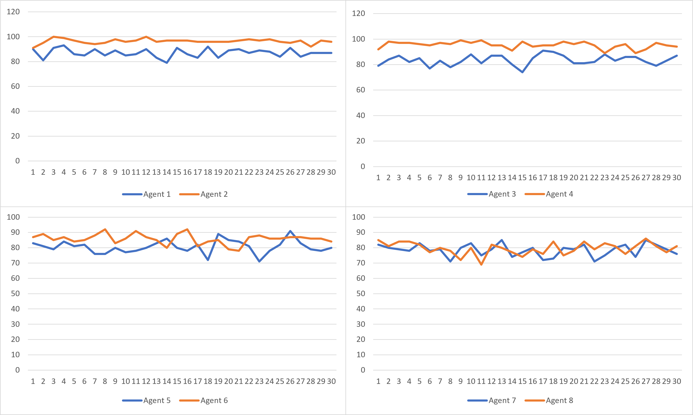

## Details

- All agents were run 100 iterations per run.
- Each Iteration was run on a different graph
- 30 total runs.

## Results

- Comparison of Win-rates/Success between all agents:

- we can see that with the strategy of even agents, they consistently outperform odd agents.

`Agent 7` performs much better than `Agent 8` with faulty survey, 
Average Win-rate in each run:
| Timesteps 	|  Agent 1 	|  Agent 2 	|  Agent 3 	|  Agent 4 	|  Agent 5 	|  Agent 6 	|  Agent 7 	| Agent 7 Faulty 	| Agent 7 Faulty Fix 	|  Agent 8 	| Agent 8 Faulty 	| Agent 8 Faulty Fix 	|
|:---------:	|:--------:	|:--------:	|:--------:	|:--------:	|:--------:	|:--------:	|:--------:	|----------------	|:------------------:	|:--------:	|----------------	|:------------------:	|
|     50    	| 87.63333 	|   95.4   	| 77.43333 	| 83.63333 	| 79.53333 	|   78.7   	| 66.33333 	| 55.2           	|        61.3        	| 63.63333 	| 47             	|      55.66667      	|
|    100    	| 89.86667 	| 96.63333 	| 82.93333 	| 95.53333 	|   82.4   	| 85.63333 	| 78.03333 	| 56.83333       	|        69.3        	|   76.9   	| 51.66667       	|      67.33333      	|
|    150    	| 87.03333 	| 96.36667 	|   83.5   	|   95.3   	| 80.63333 	|   85.8   	| 78.43333 	| 58.76666667    	|        68.6        	| 79.53333 	| 52.1           	|     68.73333333    	|
|    200    	| 87.93333 	|   97.2   	| 84.06667 	|   95.9   	|   81.9   	| 86.23333 	| 78.03333 	| 59.1           	|        68.3        	| 79.86667 	| 52.1           	|      66.93333      	|

Average number of times Agent dies to Predator:
| Timesteps 	|  Agent 1 	|  Agent 2 	|  Agent 3 	|  Agent 4 	|  Agent 5 	|  Agent 6 	|  Agent 7 	| Agent 7 Faulty Fix 	|  Agent 8 	| Agent 8 Faulty Fix 	| Agent 7 Faulty 	| Agent 8 Faulty 	|
|:---------:	|:--------:	|:--------:	|:--------:	|:--------:	|:--------:	|:--------:	|:--------:	|:------------------:	|:--------:	|:------------------:	|----------------	|----------------	|
|     50    	| 12.23333 	| 3.666667 	| 16.23333 	| 4.466667 	| 18.4     	| 11.5     	| 17.23333 	| 27.9               	| 14.86667 	| 29.46667           	| 37.13333       	| 42.5           	|
|    100    	| 10.13333 	| 3.266667 	| 16.93333 	| 3.7      	| 17.6     	| 13.46667 	| 20.36667 	| 30.1               	| 20.3     	| 31.4               	| 43.2           	| 48.03333       	|
|    150    	| 12.96667 	| 3.533333 	| 16.5     	| 4.5      	| 19.36667 	| 14.13333 	| 21.33333 	| 31.36666667        	| 20       	| 31.06666667        	| 41.83333       	| 47.83333       	|
|    200    	| 12.06667 	| 2.8      	| 15.93333 	| 4.1      	| 18.1     	| 13.73333 	| 21.96667 	| 31.7               	| 20.1     	| 33.06667           	| 41.3           	| 47.9           	|

Average number of Timeouts in each run:
| Timesteps 	|  Agent 1 	|  Agent 2 	|  Agent 3 	|  Agent 4 	|  Agent 5 	|  Agent 6 	|  Agent 7 	| Agent 7 Faulty 	| Agent 7 Faulty Fix 	|  Agent 8 	| Agent 8 Faulty 	| Agent 8 Faulty Fix 	|
|:---------:	|:--------:	|:--------:	|:--------:	|:--------:	|:--------:	|:--------:	|:--------:	|----------------	|:------------------:	|:--------:	|----------------	|:------------------:	|
|     50    	| 0.133333 	| 0.933333 	| 6.333333 	| 11.9     	| 2.066667 	| 9.8      	| 16.43333 	| 7.933333       	| 10.8               	| 21.5     	| 10.5           	| 14.86667           	|
|    100    	| 0        	| 0.1      	| 0.133333 	| 0.766667 	| 0        	| 0.9      	| 1.6      	| 0.266667       	| 0.6                	| 2.8      	| 0.3            	| 1.266667           	|
|    150    	| 0        	| 0.1      	| 0        	| 0.2      	| 0        	| 0.066667 	| 0.233333 	| 0              	| 0.033333333        	| 0.466667 	| 0.066667       	| 0.2                	|
|    200    	| 0        	| 0        	| 0        	| 0        	| 0        	| 0.033333 	| 0        	| 0              	| 0                  	| 0.033333 	| 0              	| 0                  	|

- After 200+ iterations, there are no more timeouts in any of the agents.

## Agent 9 to outperform Agent 8 with faulty survey?

Ideas:
- When the agent surveys, survey for node that has the highest combined probability of prey and predator.
  - This way, hopefully we are surveying for atleast one of them at once.